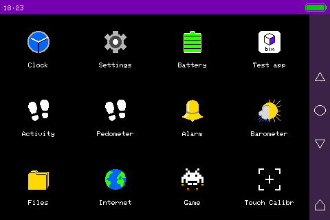

# CubOS

A tiny operating system for embedded and wearable devices to interact with users

Use CubOS as a wearable device or a device for automating processes for data entry or for controls

* Easy to write drivers
* Easy adapt to other platform
* Easy to add new applications
* Good for slow CPU and small memory
* Support of touchscreens and hardware buttons
* Easy start

Feel free to contact me at yacubovvs@yandex.ru

## CubOS on wristbands

## CubOS on smartwatch

## CubOS on build-in systems

## CubOS on tablets

# Developing with emulator on PC

### Minimum system requirements for CubOS:
* 64 kB ROM
* 2 kB RAM
* С++ compiler

Any builds at [outputs/](outputs/)

### Ready releases:
* [M5Stick C](releases/M5StickC/)
* [TTGO-T-Wristband](releases/TTGO_T-Wristband/)

## Testing on:
- M5stick-C
- M5stick-C Plus
- M5Stack
- M5Stack Core2
- TTGO-T-Wristband
- TTGO-T-Wristband
- Lilygo T-Watch-2020 v3
- Lilygo T-Watch-2020 v2
- Arduino Mega256
- Esp8266
- Esp32

### Arduino compatible

